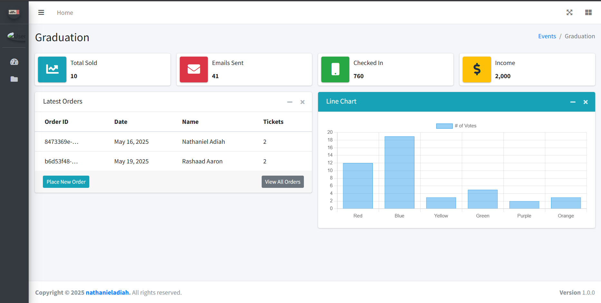
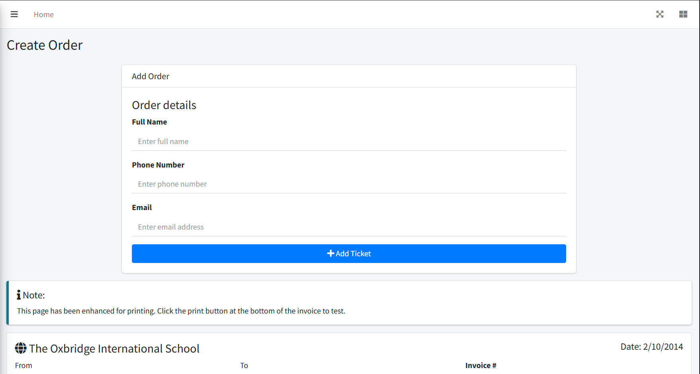
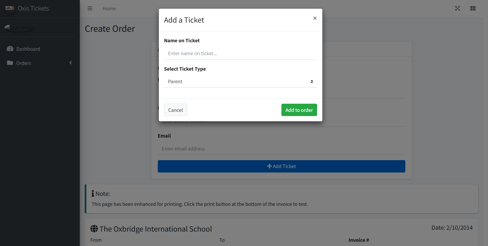
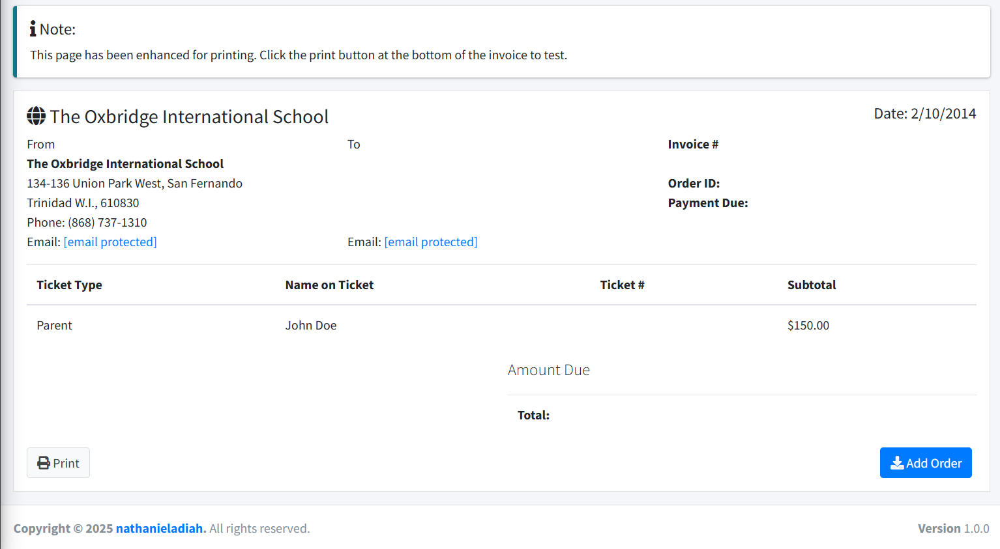
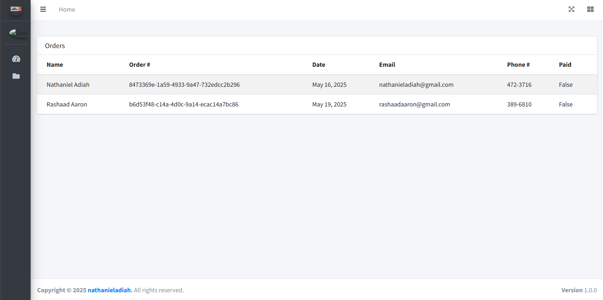

<!--  -->

# A Django Ticketing Website

A webapp that allows unique tickets to be generated and emailed to customers.


# Table of contents

- [A Django Ticketing Website](#a-django-ticketing-website)
- [Table of contents](#table-of-contents)
- [Installation](#installation)
- [Usage](#usage)
- [Development](#development)
  - [Features](#features)
- [License](#license)

# Installation

To use this project, first clone the repo on your device using the command below:

```
git clone https://github.com/adiah-web-dev/oxis-tickets.git
```

Then `cd` into the directory.

```
cd oxis-tickets
```

Create a virtual environment and activate. (I use venv, so this could be accomplished with):

```
python -m venv .venv

.venv/scripts/activate
```

Install the dependencies:

```
pip install -r requirements.txt
```

Add email credentials

Create a file named `.env`
And enter the email credentials as follows

```bash
EMAIL_ACCOUNT = 'user@gmail.com'
EMAIL_PASSWORD = 'paslkndzdvbiwjfrx'
```

Create a superuser

```
python manage.py createsuperuser
```

Then run database migrations

```
python manage.py migrate
```

And run the server

```
python manage.py runserver
```


[(Back to top)](#table-of-contents)

# Usage

On the home page click on the `place new order` button.


Enter the order details.
- the full name
- phone number
- email address
of the person placing the order.

Then click on the `Add Ticket` button.



For each ticket being ordered, Enter the name and type of ticket being ordered and then click `Add to order`.



Scroll to the bottom of the page and click the `Add Order` button.



Once, the orders page loads, the process is complete and the email has been sent.



[(Back to top)](#table-of-contents)

# Development

## Features

- [x] Allow user to enter customer order details

- [x] Multiple tickets can be added to one order

- [x] Once an order is completed successfully, an email is sent with all the tickets

- [ ] Allow user to scan tickets


[(Back to top)](#table-of-contents)

# License

[(Back to top)](#table-of-contents)

[GNU General Public License version 3](https://opensource.org/licenses/GPL-3.0)

<!--  -->
